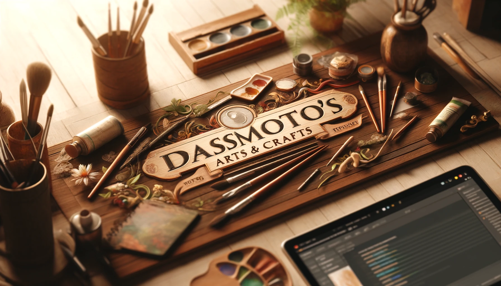

# Dasmoto's Arts & Crafts

Welcome to my first HTML website project!

# 🎨 Dasmoto's Arts & Crafts 🖌️

Welcome to my first HTML website project!

## 🌟 Overview
This website showcases various art supplies available at Dasmoto's Arts & Crafts store. It's built using basic HTML and CSS to provide a clean and simple user experience.

## 🛠️ Features
- **Brushes**: High-quality oak Hacksaw brushes.
- **Frames**: Handmade solid wood art frames.
- **Paints**: Variety of colors in sets of 12, 24, and 48.

## 📂 Project Structure
- `index.html`: Main HTML file.
- `index.css`: CSS for styling.
- `pictures/`: Directory containing all images.

